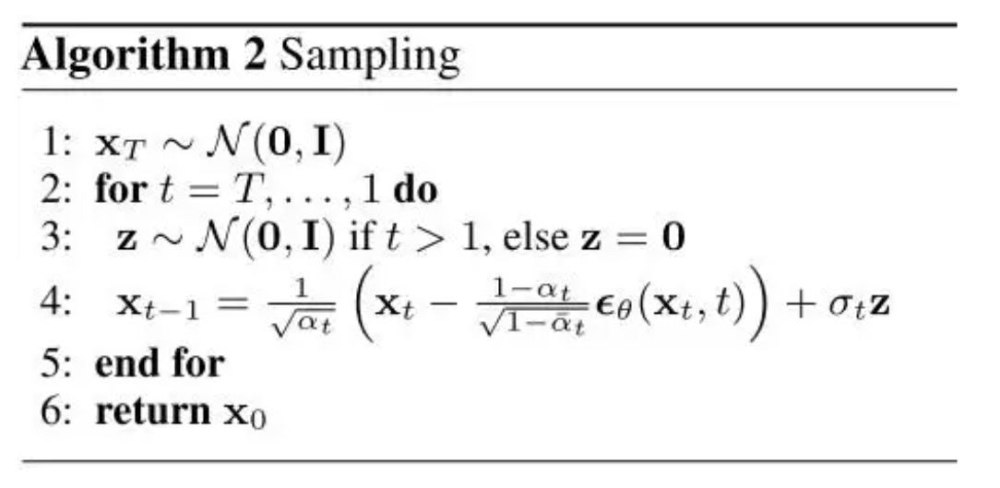
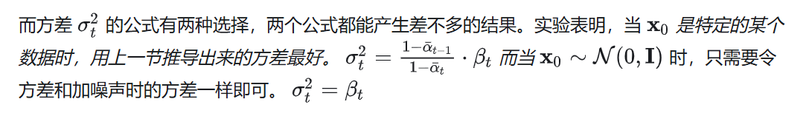
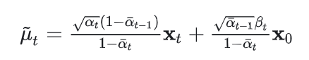
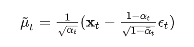
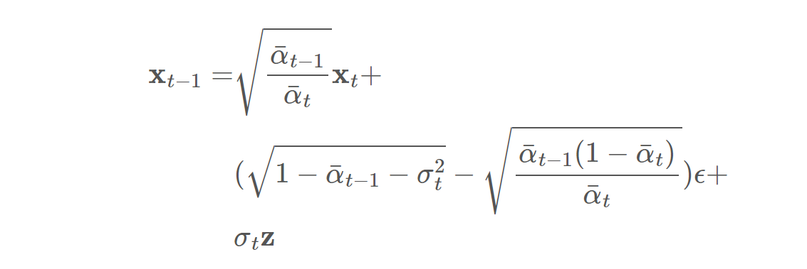
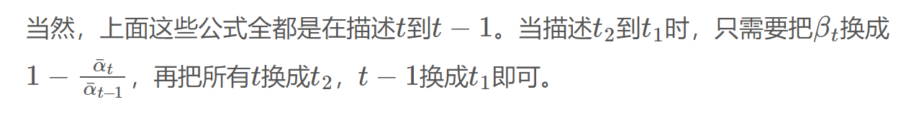
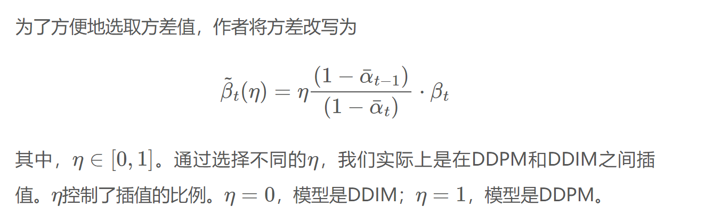
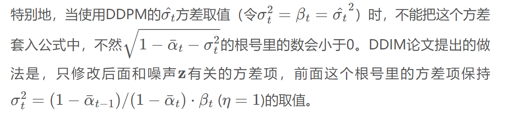

# pytorch编程实现DDIM

DDIM论文提出了DDPM的两个拓展方向：加速采样、变更采样方差。通过同时使用这两个方法，我们能够在不重新训练DDPM、尽可能不降低生成质量的前提下，让扩散模型的采样速度大幅提升（一般可以快50倍）。

# DDPM实现

首先温习一下DDPM的实现部分的关键模块。

## DDPM初始化和采样

根据输入图片 $x_0$ 和采样步数 $t$ ,既可以得到采样t步后的 $x_t$ :

$$
x_t= \sqrt{\bar{\alpha_{t}}}x_0 +  \sqrt{1-\bar{\alpha_{t}}} \epsilon
$$

### DDPM参数初始化

`​betas:` ​在DDPM论文中, $\beta_{t}$ 从 $\beta_{1}$ = 10−4 到 $\beta_{t}$ = 0.02 线性增长

​`alphas:` ​在DDPM论文中， $\alpha_{t} = 1 - \beta_{t}$

​`alpha_bars:`​在DDPM论文中， $\bar{\alpha_{t}} $​= $\alpha_{1} ... \alpha_{t}$  

```python
# n_steps 就是论文里的 T
    def __init__(self,
                 device,
                 n_steps: int,
                 min_beta: float = 0.0001,
                 max_beta: float = 0.02):
        # 从 min_beta 到 max_beta 线性地生成 n_steps 个时刻的 beta 值
        betas = torch.linspace(min_beta, max_beta, n_steps).to(device)
        alphas = 1 - betas
        # torch.empty_like(alphas) 的作用是创建一个与 alphas 张量形状相同但未初始化的张量。
        alpha_bars = torch.empty_like(alphas)
        product = 1
        for i, alpha in enumerate(alphas):
            product *= alpha
            alpha_bars[i] = product
        self.betas = betas
        self.n_steps = n_steps
        self.alphas = alphas
        self.alpha_bars = alpha_bars

        # ???
        alpha_prev = torch.empty_like(alpha_bars)
        alpha_prev[1:] = alpha_bars[0:n_steps - 1]
        alpha_prev[0] = 1
        self.coef1 = torch.sqrt(alphas) * (1 - alpha_prev) / (1 - alpha_bars)
        self.coef2 = torch.sqrt(alpha_prev) * self.betas / (1 - alpha_bars)
```

### DDPM采样

根据输入图片 $x_0$ 和采样步数 $t$ ,既可以得到采样t步后的 $x_t$ :

$$
x_t= \sqrt{\bar{\alpha_{t}}}x_0 +  \sqrt{1-\bar{\alpha_{t}}} \epsilon
$$

```python
    def sample_forward(self, x, t, eps=None):
        # 将从 self.alpha_bars 中选择的 alpha_bar 值重塑为适合与输入张量 x 进行广播的形状。
        alpha_bar = self.alpha_bars[t].reshape(-1, 1, 1, 1)
        if eps is None:
            # torch.randn_like(x) 是 PyTorch 中的一个函数，用于生成与给定张量 x 形状相同的张量，其中的元素是从标准正态分布（均值为 0，方差为 1）中随机抽取的。
            eps = torch.randn_like(x)
        res = eps * torch.sqrt(1 - alpha_bar) + torch.sqrt(alpha_bar) * x
        return res
```

## DDPM去噪

### 反向过程算法

​​

### 反向过程的方差选择

​​

### 均值计算公式（两种）

​​

### 实现

```python
def sample_backward_step(self, x_t, t, net, simple_var=True, clip_x0=True):
        # 获取batch_size n
        n = x_t.shape[0]
		# 给每个样本的输入添加一个采样次数t
        t_tensor = torch.tensor([t] * n,
                                dtype=torch.long).to(x_t.device).unsqueeze(1)
        eps = net(x_t, t_tensor)

        if t == 0:
            # t=0 时，没有方差项
            noise = 0
        else:
            # 方差项用到的方差有两种取值，效果差不多，我们用simple_var来控制选哪种取值方式。
            if simple_var:
                var = self.betas[t]
            else:
                var = (1 - self.alpha_bars[t - 1]) / (
                    1 - self.alpha_bars[t]) * self.betas[t]
            noise = torch.randn_like(x_t)
            noise *= torch.sqrt(var)
  
        if clip_x0:
            x_0 = (x_t - torch.sqrt(1 - self.alpha_bars[t]) *
                   eps) / torch.sqrt(self.alpha_bars[t])
            """
                将 x_0 的值限制在 -1 到 1 的范围内。任何小于 -1 的值会被设为 -1，任何大于 1 的值会被设为 1。
                这一步是为了确保 x_0 的数值稳定性，防止数值过大或过小导致的问题。
            """
            x_0 = torch.clip(x_0, -1, 1)
            mean = self.coef1[t] * x_t + self.coef2[t] * x_0
        else:
            mean = (x_t -
                    (1 - self.alphas[t]) / torch.sqrt(1 - self.alpha_bars[t]) *
                    eps) / torch.sqrt(self.alphas[t])
        x_t = mean + noise

        return x_t
```

# DDIM

## 初始化函数和前向过程函数和DDPM类似

​`DDIM`​是`DDPM`​的推广，我们可以直接用`DDIM`​类继承`DDPM`​类。它们共享初始化函数与前向过程函数。

## 反向过程

DDPM的计算 $x_{t-1}$ 公式：

​

DDIM的计算 $x_{t-1}$ 公式：

​

​​​​

### 计算 $\sigma_t z$

​​  

​​

与DDPM不同，在计算方差`var`​时（公式里的 $\sigma_t^2$ ），我们要给方差乘一个权重`eta`​。

已知

$
\sigma_t^2 = \frac{1 - \bar{\alpha}_{t-1}}{1 - \bar{\alpha}_{t}} \cdot \beta_t
$

由于 

$$
1 - \frac{\bar{\alpha}_{t}}{\bar{\alpha}_{t-1}} = \frac{\bar{\alpha}_{t-1} - \bar{\alpha}_{t}}{\bar{\alpha}_{t-1}} = \frac{(1 - \alpha_t) \bar{\alpha}_{t-1}}{\bar{\alpha}_{t-1}} = 1 - \alpha_t = \beta_t
$$ 

,故 

$$
\sigma_t^2 = \frac{1 - \bar{\alpha}_{t-1}}{1 - \bar{\alpha}_{t}} \cdot \left(1 - \frac{\bar{\alpha}_{t}}{\bar{\alpha}_{t-1}}\right).
$$

$$
已知 σ_t^2=\frac{1-\bar\alpha_{t-1}}{1-\bar\alpha_{t}}.\beta_t ，由于 1- \frac{\bar{\alpha_{t}}}{\bar{\alpha_{t-1}}} =  \frac{ \bar{\alpha}_{t-1} - \bar{\alpha_{t}}}{\bar{\alpha}_{t-1}}=\frac{(1-\alpha_t) \bar{\alpha}_{t-1}}{\bar{\alpha}_{t-1}} =1-\alpha_t=\beta_t ，故 σ_t^2=\frac{1-\bar\alpha_{t-1}}{1-\bar\alpha_{t}}.(1- \frac{\bar{\alpha_{t}}}{\bar{\alpha_{t-1}}})
$$

​​

```python
# 获取预测的噪声分布 eps
t_tensor = torch.tensor([cur_t] * batch_size,
                        dtype=torch.long).to(device).unsqueeze(1)
eps = net(x, t_tensor)

# 计算方差 \delta
var = eta * (1 - ab_prev) / (1 - ab_cur) * (1 - ab_cur / ab_prev)
# 随机分布z
noise = torch.randn_like(x)
```

## 计算`first_term, second_term, third_term`​

​

​​

```python
first_term = (ab_prev / ab_cur)**0.5 * x
second_term = ((1 - ab_prev - var)**0.5 -
                (ab_prev * (1 - ab_cur) / ab_cur)**0.5) * eps
if simple_var:
    third_term = (1 - ab_cur / ab_prev)**0.5 * noise
else:
    third_term = var**0.5 * noise
x = first_term + second_term + third_term
```

## 完整去噪代码

```python
def sample_backward(self,
                        img_or_shape,
                        net,
                        device,
                        simple_var=True,
                        ddim_step=20, # 表示执行几轮去噪迭代
                        eta=1): # 表示DDPM和DDIM的插值系数
        # 在开始迭代前，要做一些预处理。根据论文的描述，如果使用了DDPM的那种简单方差，一定要令eta=1
        if simple_var:
            eta = 1
        # 我们会用到从self.n_steps到0等间距的ddim_step+1个时刻（self.n_steps是初始时刻，不在去噪迭代中）。
        # 比如总时刻self.n_steps=100，ddim_step=10，ts数组里的内容就是[100, 90, 80, 70, 60, 50, 40, 30, 20, 10, 0]。
        ts = torch.linspace(self.n_steps, 0,
                            (ddim_step + 1)).to(device).to(torch.long)
        if isinstance(img_or_shape, torch.Tensor):
            x = img_or_shape
        else:
            # 如果 img_or_shape 不是张量（通常意味着它是一个形状规格，如元组），则生成一个随机张量。
                # torch.randn(img_or_shape)创建一个填充有来自标准正态分布（均值为 0，标准差为 1）的随机数的张量。
                # 张量的大小由 img_or_shape 指定。
            x = torch.randn(img_or_shape).to(device)
        batch_size = x.shape[0]
        net = net.to(device)
        for i in tqdm(range(1, ddim_step + 1),
                      f'DDIM sampling with eta {eta} simple_var {simple_var}'):
            cur_t = ts[i - 1] - 1
            prev_t = ts[i] - 1

            ab_cur = self.alpha_bars[cur_t]
            ab_prev = self.alpha_bars[prev_t] if prev_t >= 0 else 1
            # 给每个样本添加一个 cur_t 采样步数标签
            # 这部分代码创建一个一维张量，其元素为 cur_t，重复 batch_size 次。
            t_tensor = torch.tensor([cur_t] * batch_size,
                                    dtype=torch.long).to(device).unsqueeze(1)
            eps = net(x, t_tensor)
            var = eta * (1 - ab_prev) / (1 - ab_cur) * (1 - ab_cur / ab_prev)
            noise = torch.randn_like(x)

            first_term = (ab_prev / ab_cur)**0.5 * x
            second_term = ((1 - ab_prev - var)**0.5 -
                           (ab_prev * (1 - ab_cur) / ab_cur)**0.5) * eps
            if simple_var:
                third_term = (1 - ab_cur / ab_prev)**0.5 * noise
            else:
                third_term = var**0.5 * noise
            x = first_term + second_term + third_term

        return x
```

# 参考资料

[DDIM 简明讲解与 PyTorch 实现：加速扩散模型采样的通用方法](https://zhouyifan.net/2023/07/07/20230702-DDIM/)

[生成扩散模型漫谈（四）：DDIM=高观点DDPM](https://spaces.ac.cn/archives/9181)

‍
