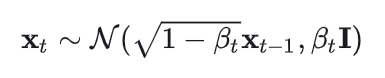
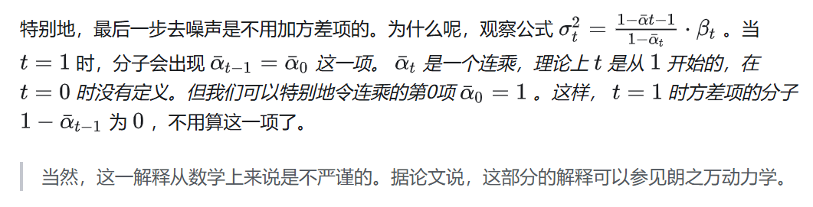

# diffusion实践Demo

# [Diffusion Model 详解：直观理解、数学原理、PyTorch 实现](https://zhuanlan.zhihu.com/p/638442430?utm_campaign=shareopn&utm_medium=social&utm_psn=1824081730681851905&utm_source=wechat_session)

**VAE则使用了逆向思维：**学习向量生成图像很困难，那就再同时学习怎么用图像生成向量。这样，把某图像变成向量，再用该向量生成图像，就应该得到一幅和原图像一模一样的图像。每一个向量的绘画结果有了一个标准答案，可以用一般的优化方法来指导网络的训练了。VAE中，把图像变成向量的网络叫做编码器，把向量转换回图像的网络叫做解码器。其中，解码器就是负责生成图像的模型。

具体来说，扩散模型由**正向过程**和**反向过程**这两部分组成，对应VAE中的编码和解码。在正向过程中，输入 $x_0$ 会不断混入高斯噪声。经过 T 次加噪声操作后，图像 $x_T$ 会变成一幅符合标准正态分布的纯噪声图像。而在反向过程中，我们希望训练出一个神经网络，该网络能够学会 T 个去噪声操作，把 $x_T$ 还原回 $x_0$。网络的学习目标是让 T 个去噪声操作正好能抵消掉对应的加噪声操作。训练完毕后，只需要从标准正态分布里随机采样出一个噪声，再利用反向过程里的神经网络把该噪声恢复成一幅图像，就能够生成一幅图片了。

> 高斯噪声，就是一幅各处颜色值都满足高斯分布（正态分布）的噪声图像。

## 前向过程

在前向过程中，来自训练集的图像 $x_0$ *会被添加* T *次噪声，使得* $x_T$ *为符合标准正态分布。准确来说，「加噪声」并不是给上一时刻的图像加上噪声值，而是从一个均值与上一时刻图像相关的正态分布里采样出一幅新图像。如下面的公式所示，* $x_{t-1}$ 是上一时刻的图像， $x_t$ *是这一时刻生成的图像，该图像是从一个均值与* $x_{t-1}$有关的正态分布里采样出来的。

绝大多数扩散模型会把这个正态分布设置成这个形式：

​​

在DDPM论文中， $\beta_{t}$ 从 $\beta_{1}$ = 10−4 到 $\beta_{t}$ = 0.02 线性增长。这样，$\beta_{t}$ 变大, $\alpha_{t}$ 也越小， $\bar{\alpha_{t}}$  ​*趋于0的速度越来越快。最后，* $\bar{\alpha_{t}}$​*几乎为0，代入* $x_t=\sqrt{\bar{\alpha}_T}x_o+\sqrt{1-\bar{\alpha}_T}\epsilon$ , $x_t$ 就满足标准正态分布了，符合我们对扩散模型的要求。上述推断可以简单描述为：加噪声公式能够从慢到快地改变原图像，让图像最终均值为0，方差为I 。

## 反向过程

​​

### 反向过程算法

​​

### 反向过程的方差选择

​​

## ptorch实践理解

1. 对于一张图片的前向过程加噪，其加噪结果的差异性体现在随机采样的噪声$noise$和加噪的步数$step$

​​

```python
"""
输入：原始图片（x）,加噪步数（t）,随机采样噪声（eps）
输出：加噪t次后的图片x_t
"""
def sample_forward(self, x, t, eps=None):
        # 将从 self.alpha_bars 中选择的 alpha_bar 值重塑为适合与输入张量 x 进行广播的形状。
        alpha_bar = self.alpha_bars[t].reshape(-1, 1, 1, 1)
        if eps is None:
            # torch.randn_like(x) 是 PyTorch 中的一个函数，用于生成与给定张量 x 形状相同的张量，其中的元素是从标准正态分布（均值为 0，方差为 1）中随机抽取的。
            eps = torch.randn_like(x)
        res = eps * torch.sqrt(1 - alpha_bar) + torch.sqrt(alpha_bar) * x
        return res
```

2. 优化目标是$预测噪声$和$采样噪声$之间的$MSE$

```python
loss_fn = nn.MSELoss()
...
loss = loss_fn(eps_theta, eps)
```

3. $net$ 的作用：给定一张噪声图片和采样步数t,预测加噪噪声

    1. 在训练时：给定$输入图片x_0$经过 $t$ 次加噪的图片$x_t$和加噪步数$t$,预测$原始加噪噪声$
    2. 在推理时：给定$初始噪声$和$采样步数$的前提下$预测噪声$，并根据$预测噪声$从$初始噪声$中还原$图片$

4. 反向推理，输入为$x_t$和$t$,输出为$x_0$

反向过程算法：

​​

方差计算公式：

​​

​​

均值计算公式（两种）：

​​

```python
def sample_backward_step(self, x_t, t, net, simple_var=True, clip_x0=True):
        # 获取batch_size n
        n = x_t.shape[0]
        t_tensor = torch.tensor([t] * n,
                                dtype=torch.long).to(x_t.device).unsqueeze(1)
        eps = net(x_t, t_tensor)

        if t == 0:
            # t=0 时，没有方差项
            noise = 0
        else:
            # 方差项用到的方差有两种取值，效果差不多，我们用simple_var来控制选哪种取值方式。
            if simple_var:
                var = self.betas[t]
            else:
                var = (1 - self.alpha_bars[t - 1]) / (
                    1 - self.alpha_bars[t]) * self.betas[t]
            noise = torch.randn_like(x_t)
            noise *= torch.sqrt(var)
    
        if clip_x0:
            x_0 = (x_t - torch.sqrt(1 - self.alpha_bars[t]) *
                   eps) / torch.sqrt(self.alpha_bars[t])
            """
                将 x_0 的值限制在 -1 到 1 的范围内。任何小于 -1 的值会被设为 -1，任何大于 1 的值会被设为 1。
                这一步是为了确保 x_0 的数值稳定性，防止数值过大或过小导致的问题。
            """
            x_0 = torch.clip(x_0, -1, 1)
            mean = self.coef1[t] * x_t + self.coef2[t] * x_0
        else:
            mean = (x_t -
                    (1 - self.alphas[t]) / torch.sqrt(1 - self.alpha_bars[t]) *
                    eps) / torch.sqrt(self.alphas[t])
        x_t = mean + noise

        return x_t
```
